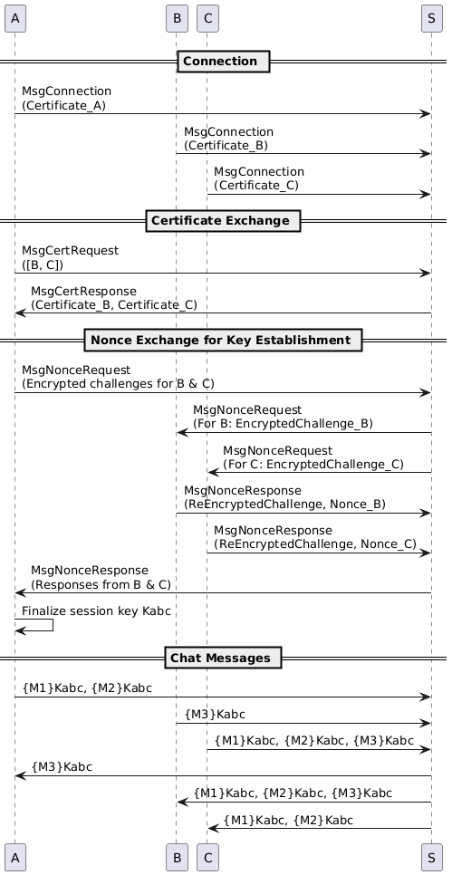
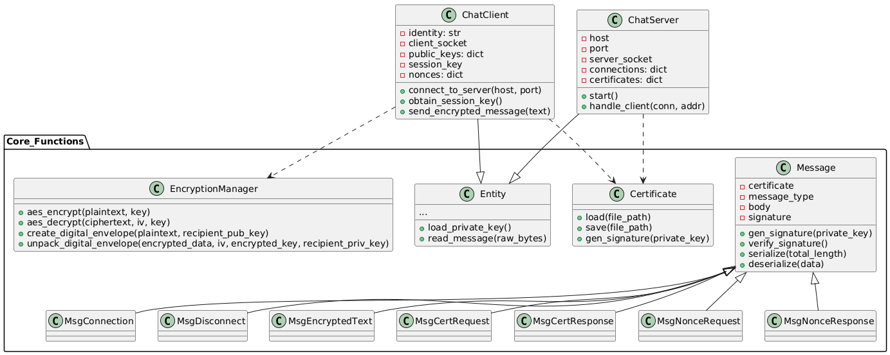

# SecureChatX
---

## Table of Contents

- [Introduction](#introduction)
- [Problem Statement](#problem-statement)
- [How It Works](#how-it-works)
- [Directory Structure](#directory-structure)
- [File Descriptions](#file-descriptions)
- [Certificates and Cryptography](#certificates-and-cryptography)
- [Diagrams and Images](#diagrams-and-images)
- [Setup and Running the Application](#setup-and-running-the-application)
- [Additional Documentation](#additional-documentation)
- [Security Analysis and Future Work](#security-analysis-and-future-work)
- [Conclusion](#conclusion)
- [License](#license)

---

## Introduction

SecureChatX is designed to address the challenge of establishing secure communication channels over untrusted networks. In our application, three clients (A, B, and C) engage in an encrypted chat session by establishing a shared session key (K₍ₐᵦ𝚌₎) using a nonce-based key exchange protocol. All communications are routed through a central server that relays messages without accessing the session key, ensuring end-to-end encryption. Each participant—both clients and the server—possesses an RSA key pair and a digital certificate, providing robust authentication and integrity checks.

---

## Problem Statement

In modern distributed systems, securing direct communications between clients, especially when a relay server is involved, presents several challenges:
- **Data Confidentiality:** Ensure that sensitive messages remain private and are not exposed to intermediaries.
- **Authentication:** Verify that only legitimate clients participate in the chat by using digital certificates.
- **Integrity:** Protect messages from tampering during transit.
- **Key Establishment:** Provide a mechanism for clients to agree on a common session key without the server learning it.

SecureChatX addresses these issues by using RSA for key transport and digital signatures, and AES for efficient symmetric encryption of messages.

---

## How It Works

The SecureChatX protocol comprises several phases:

### 1. Connection Phase
- **Client Initiation:** Each client establishes a TCP connection to the server.
- **Certificate Transmission:** Upon connection, clients send a `MsgConnection` message that includes their digital certificate.  
  *Purpose:* To authenticate the client and provide its public key.

### 2. Certificate Exchange
- **Request:** A client (say, Entity A) sends a `MsgCertRequest` to the server asking for the certificates of the other entities (B and C).
- **Response:** The server replies with a `MsgCertResponse` containing the requested certificates.  
  *Purpose:* To enable A to obtain the public keys necessary for encrypting nonce challenges.

### 3. Nonce-Based Key Establishment
- **Nonce Generation:** Client A generates a random nonce (challenge) for each target client.
- **Nonce Request:** A encrypts each nonce using the respective target’s public key and sends these in a `MsgNonceRequest`.
- **Nonce Response:** The target clients (B and C) decrypt the nonce, re-encrypt it with A’s public key (proving proper decryption), and attach their own randomly generated nonce in a `MsgNonceResponse`.
- **Session Key Derivation:** Once A receives the responses, it verifies the re-encrypted challenges and combines all nonces (including its own) using bitwise operations and a SHA-256 hash to derive the shared session key K₍ₐᵦ𝚌₎.  
  *Purpose:* To ensure that all parties have contributed to the session key and to prevent any single entity (including the server) from knowing it.

### 4. Secure Chat Messaging
- **Encryption:** With K₍ₐᵦ𝚌₎ established, clients encrypt their chat messages using AES in CBC mode.
- **Relay:** The server relays the encrypted messages to the other clients without decryption.
- **Decryption:** Each client decrypts the incoming messages using K₍ₐᵦ𝚌₎.  
  *Purpose:* To maintain confidentiality and integrity of the chat messages.

---

## Directory Structure

The repository is organized as follows:

```
SecureChatApp
├── Certs
│   ├── Certificate_A.cer
│   ├── Certificate_B.cer
│   ├── Certificate_C.cer
│   └── Certificate_S.cer
├── ChatClient.py
├── ChatServer.py
├── Core_Functions
│   ├── CertificateManager.py
│   ├── EncryptionManager.py
│   ├── Entity.py
│   └── MessageProtocol.py
├── GenerateCertificates.py
└── Keys
    ├── PrivateKey_A.pem
    ├── PrivateKey_B.pem
    ├── PrivateKey_C.pem
    └── PrivateKey_S.pem
```

*Note:* The `Certs` and `Keys` folders contain the pre-generated certificates and RSA private keys. If you wish to regenerate them, simply delete these folders and run the provided certificate generation script.

---

## File Descriptions

- **ChatClient.py**  
  Implements the secure chat client used by entities A, B, and C. Responsibilities include:
  - Connecting to the server.
  - Requesting certificates for other clients.
  - Initiating nonce-based key exchange.
  - Encrypting and sending chat messages using AES.
  - Receiving and decrypting messages.
  
- **ChatServer.py**  
  Implements the chat server which acts solely as a message relay. Key features:
  - Accepts TCP connections from clients.
  - Forwards messages between clients without decryption.
  - Handles certificate requests and manages client connections.

- **Core_Functions/CertificateManager.py**  
  Manages digital certificates by handling:
  - Loading and saving certificates.
  - Signing certificates using RSA (with SHA-256).
  - Storing the identity and public key of an entity.

- **Core_Functions/EncryptionManager.py**  
  Provides cryptographic functions:
  - AES encryption/decryption (CBC mode with PKCS#7 padding).
  - RSA encryption/decryption for key transport and nonce challenges.
  - Creating and unpacking digital envelopes.

- **Core_Functions/Entity.py**  
  An abstract base class for both clients and the server. Responsibilities:
  - Loading the RSA private key from file.
  - Parsing incoming messages and dispatching them to appropriate handlers.

- **Core_Functions/MessageProtocol.py**  
  Defines the structure and types of messages exchanged:
  - Message base class with common fields (certificate, type, body, signature).
  - Specialized messages such as `MsgConnection`, `MsgCertRequest`, `MsgNonceRequest`, `MsgNonceResponse`, and `MsgEncryptedText`.
  - Digital signature generation and verification.

- **GenerateCertificates.py**  
  A script that generates new RSA key pairs and self-signed certificates for all entities (A, B, C, and S). Pre-generated certificates are included; however, you can regenerate them if needed.

- **Certs/** and **Keys/** folders  
  These directories store the public key certificates and private RSA keys for each entity.

---

## Certificates and Cryptography

SecureChatX uses:
- **RSA:** 2048-bit keys are generated for each entity. RSA is used for:
  - Encrypting nonce challenges.
  - Wrapping keys in digital envelopes.
  - Signing certificates and messages using SHA-256.
- **Digital Certificates:**  
  Each certificate contains the entity's identity and RSA public key. Certificates are either self-signed or signed by the server acting as a Certificate Authority.
- **AES:**  
  Used for encrypting chat messages with the session key. AES is implemented in CBC mode with PKCS#7 padding, ensuring efficient and secure encryption.

This combination of RSA and AES ensures that:
- Only authorized clients can decrypt messages.
- All messages are authenticated and their integrity is verified using digital signatures.
- The server, acting as a relay, never gains access to the session key or plaintext messages.

---

## Diagrams and Images

Below are some of the most important diagrams that explain the design and operation of SecureChatX. For full documentation, please refer to the included PDF.

### High-Level Protocol Overview  
**Image File:**   
  
*Explanation:* This diagram provides a bird's-eye view of the entire protocol. It shows how clients connect to the server, exchange certificates, perform nonce-based key establishment, and finally send encrypted chat messages. It emphasizes that the server acts merely as a relay and never accesses the session key.

### Detailed Sequence Diagram for Key Establishment  
**Image File:**  
  
*Explanation:* This diagram details the step-by-step exchange during the key establishment phase. It shows how Client A requests certificates, sends encrypted nonce challenges to Clients B and C, and then derives the shared session key by combining the received nonces.

### UML Class Diagram  
**Image File:**  
  
*Explanation:* The UML diagram illustrates the relationships between the core classes in the application, including the base Entity class, Certificate management, Encryption functions, and the various Message types. This helps in understanding the overall architecture of the codebase.

### Detailed Cryptographic Operations Diagram  
**Image File:** 
  
*Explanation:* This diagram focuses on the internal cryptographic operations. It shows how AES is used to encrypt/decrypt messages and how RSA is employed for encrypting nonce challenges and signing messages. The diagram demonstrates how digital envelopes are created to secure key transport.

---

## Setup and Running the Application

### Prerequisites

- **Python 3.x**
- **pip** (Python package installer)

### Installation Steps

1. **Clone the Repository:**

   ```bash
   git clone https://github.com/yourusername/SecureChatX.git
   cd SecureChatX
   ```

2. **Install Dependencies:**

   Ensure you have a `requirements.txt` file with the following (or similar) packages:
   - rsa
   - pycryptodomex
   - termcolor

   Then run:

   ```bash
   pip install -r requirements.txt
   ```

3. **(Optional) Regenerate Certificates:**

   Pre-generated certificates and keys are provided. To regenerate them, delete the files contained in the `Certs/` and `Keys/` folders and then run:

   ```bash
   python GenerateCertificates.py
   ```

4. **Running the Server:**

   Start the chat server with:

   ```bash
   python ChatServer.py
   ```

5. **Running the Clients:**

   In separate terminal windows, run each client by specifying its identity (A, B, or C):

   ```bash
   python ChatClient.py A
   python ChatClient.py B
   python ChatClient.py C
   ```

After following these steps, the secure chat application will be operational. Clients can now exchange AES-encrypted messages through the central server.

---

## Additional Documentation

For a complete explanation of the protocol design, cryptographic operations, and implementation details, please refer to the PDF documentation included in the repository. This PDF provides additional context, diagrams, and analysis to complement this README.

---

## Security Analysis and Future Work

### Security Analysis
SecureChatX is built to ensure:
- **Confidentiality:** Only clients have access to the shared session key K₍ₐᵦ𝚌₎. The server only relays encrypted messages.
- **Authentication & Integrity:** Digital signatures ensure that messages are authentic and have not been altered.
- **Robust Key Establishment:** The nonce-based challenge-response protocol ensures that all parties contribute to the session key.

Potential risks like replay attacks are mitigated by the use of nonces and digital signatures. Future security enhancements might include incorporating timestamps and sequence numbers to further strengthen the protocol.

### Future Work
Possible improvements include:
- Extending support for more than three clients.
- Implementing more robust error handling and recovery for network interruptions.
- Optimizing cryptographic operations for performance on lower-powered devices.
- Integrating additional security measures such as multi-factor authentication.

---

## Conclusion

SecureChatX demonstrates a practical application of secure communication principles. By leveraging RSA for key exchange and digital signatures, and AES for efficient message encryption, the system achieves end-to-end security without the central server ever accessing the session key. This project, developed as part of a Communication & Security Protocols course, highlights the importance of cryptographic techniques in building secure distributed applications.

---

## License

This project is licensed under the MIT License. See the [LICENSE](LICENSE) file for details.

---

Feel free to reach out with any questions or suggestions. Enjoy using SecureChatX for secure, reliable communications!

---

This README should now provide a very in-depth, human-written overview of the entire project, including all essential details, diagrams with image file names, and complete instructions on how to set up and run the application.
